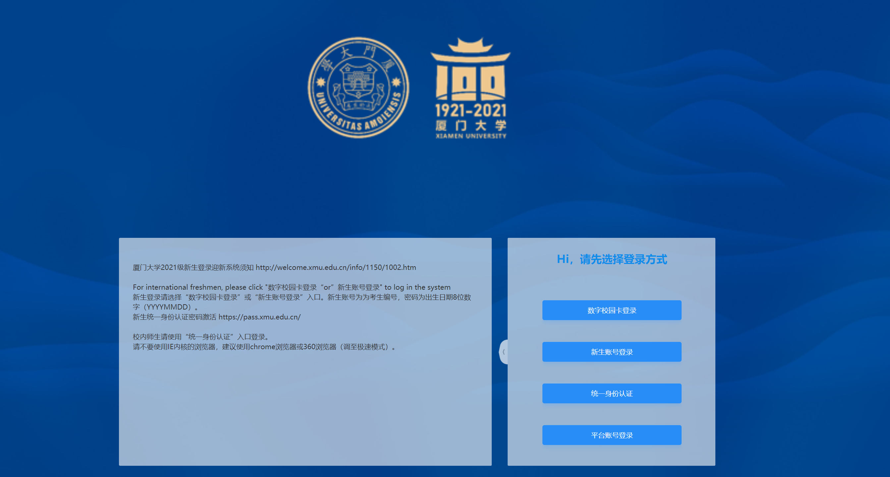
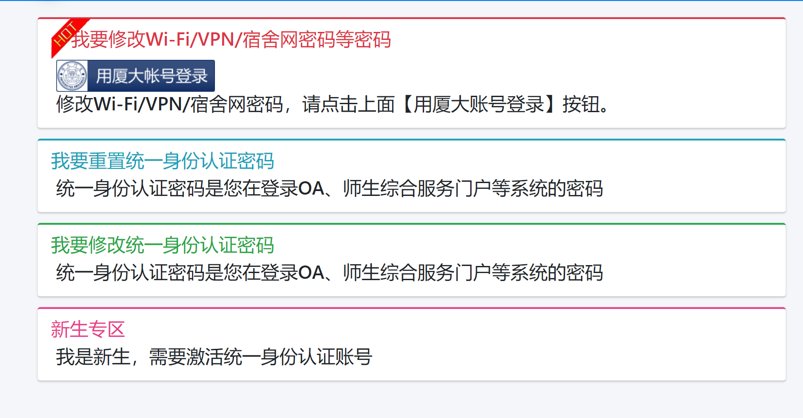
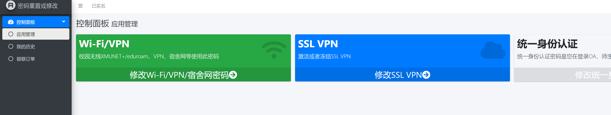
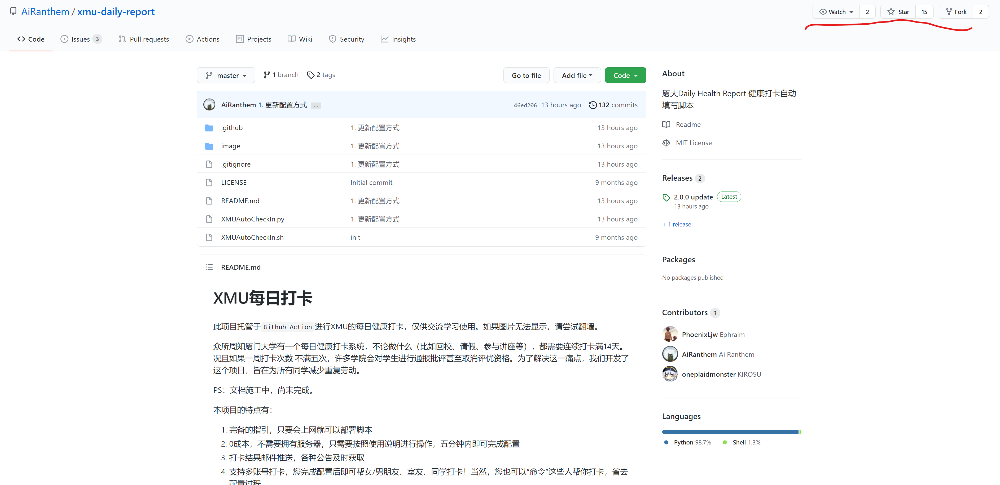
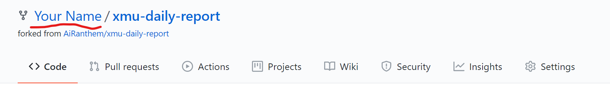
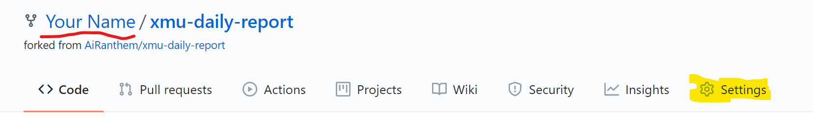
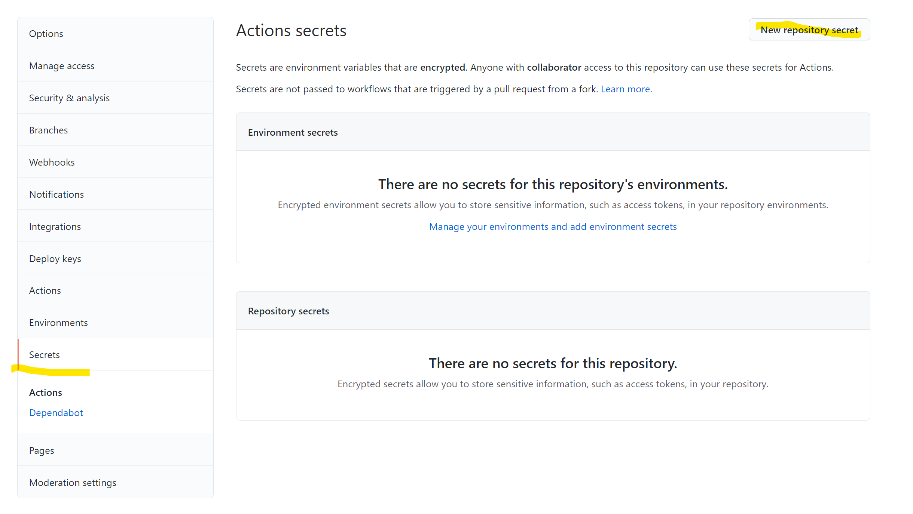
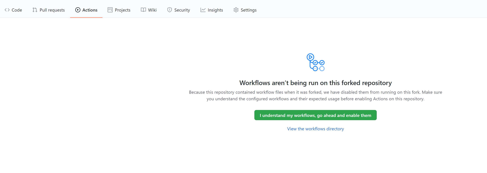
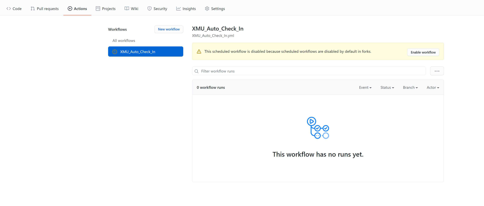
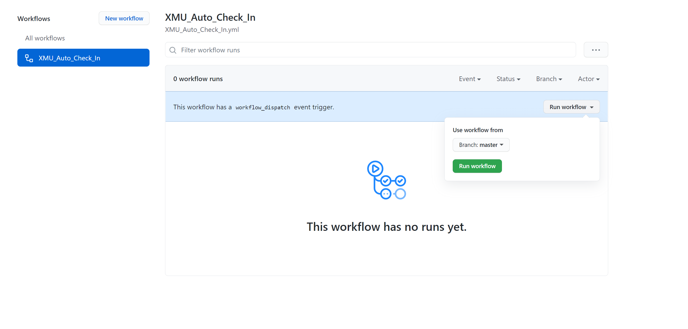

# XMU每日打卡

祝贺项目三岁啦！

此项目托管于``Github Action``进行XMU的每日健康打卡，仅供交流学习使用。如果图片无法显示，请尝试翻墙。

疫情已经到第三个年头了，每日打卡项目也已经发展到了4.0版本。面对天灾人祸我们没有办法改变世界，但是可以为自己、为朋友做一些事情。我做这个项目更多地是希望大家可以动起手来，在不那么美好的当下，面对不那么理想的现实，做一些力所能及的改变————要众志成城地对抗灾难，但是也不能逆来顺受地接收所有不合理地东西。

虽然我会长期维护这个项目，但是我不提倡、不建议任何人长期使用这个脚本，而是希望“技术宅改变世界”的精神能被别人理解。世界即将交付给我们这一代，那我们就有职责将它变得更好。

本项目的特点有：

1. 完备的指引，只要会上网就可以部署脚本
2. 0成本，不需要拥有服务器，只需要按照使用说明进行操作，五分钟内即可完成配置
3. 打卡结果邮件推送，各种公告及时获取
4. 支持多账号打卡，您完成配置后即可帮女/男朋友、室友、同学打卡！当然，您也可以“命令”这些人帮你打卡，省去配置过程。
5. 完全免费开源，欢迎同学们贡献自己的代码

如果您喜欢这个项目，请给一个小小的Star

## 置顶公告
**特殊时期，厦大网络已经封禁所有外网访问，WebVPN也不可使用**

最近可能因为某些原因GitHub无法访问厦大内网，有需要的可以先部署到自己服务器上。

目前我在准备Github Action之外的其他部署方式，规划的有Docker直接运行和Drone定时运行，不一定都做，有兴趣的可以帮忙推一个Dockerfile的PR过来。

## 免责声明

本项目的开发者完全出于以下目的而进行开发：

1. 练习 selenium、fastapi 等 python 全栈与爬虫技术
2. 学习完整的开源项目流程，包括开发、测试、维护等
3. 掌握 GitHub 的相关进阶操作

本项目承诺：

1. 该项目的所有代码、文档、示例等均是以学习全过程软件开发与学习交流为目的，所有开发者除了必要的功能测试以外，没有在任何时间下使用过这个项目。
2. 该项目父仓库的所有 Actions 均采用了测试用配置，仅仅用于监控软件状态以确认维护工作的任务，没有真正用于打卡。
3. 本项目不会保存您的所有个人信息，不必担心隐私泄露。

如果您尝试配置了本项目，请于24小时内删除，支持手动打卡工作。

本项目遵守 [MIT License](LICENSE) ,任何个人或组织拥有任意使用、复制、修改、合并、出版发行、散布、再许可和/或贩售软件及软件的副本，及授予被供应人同等权利的权利。因为第三方个人或组织使用该软件而产生的任何不良后果，本项目的 所有开发者不承担任何责任。

## 本文档编写目的

软件的文档相当于说明书，对于文档的要求即是：让基础最差的用户都能轻易看懂而上手软件。

该文档的编写完全出于练习文档写作，并不鼓励用户使用本项目。 该文档的目标受众以计算机基础能力作为差分，最低为语言类文科本科新生，最高为计算机类博士四年级生。 文档对于差分值高的用户可能过于繁琐，请谅解。

如果对文档写作有任何意见与建议，请与作者联系。

## 更新日志

### 2022/8/15 4.1更新

3.X版本已不可用，请用户尽早升级4.X版本

1. 自动选择核酸日期为当天
2. 对日志中的账号进行屏蔽保护

### 日志

+ 2021/08/18 简化配置过程，支持多账号打卡。
+ 2021/11/09 更新直接打卡策略，现在尝试VPN登录失败后会直接访问xmuxg网站打卡
+ 2021/12/26 更新一小时内随机延迟
+ 2022/03/26 API更新，代码重构
+ 2022/03/27 逻辑更新，增强鲁棒性：在进行下拉框选择前会验证是否已经有填写内容
+ 2022/04/01 面向对象重构，可以覆盖更加复杂的场景
+ 2022/05/11 修复遗留的多人打卡失败bug

## 自动化打卡条件

请仔细阅读本章节，保证自己已经满足所有自动化打卡条件。如果不满足任意一条条件，请在本章节的指导下完成相关工作，否则将无法使用该项目进行打卡。

不仅仅用于自动打卡，本章节要求您做的所有操作都是您在厦大生活必须所必须的账号，包括身份认证系统、校园网系统等。与其等到急需使用这些系统的时候手忙脚乱，不如花上五分钟 阅读完本章节，一劳永逸。

### 0. ！！！！！！请务必能够随时接收邮件！！！！！！！！

推荐安装常用邮箱对应的手机APP以接收邮件推送。每日打卡结果、脚本使用tips、重要更新公告等都会通过邮件推送！！

### 1. 能够使用统一身份认证登录

确认方式：访问[https://xmuxg.xmu.edu.cn/login](https://xmuxg.xmu.edu.cn/login) ，点击右侧第三个按钮“统一身份认证”，成功登录 （如果原先已登陆请点击右上角进行注销）



解决方案：如果您从未使用统一身份认证登录，请访问[https://pass.xmu.edu.cn](https://pass.xmu.edu.cn) ，点击“新生专区” 进行激活。如果您忘记了密码，则点击“我要修改统一身份认证密码”



### 2. 设置了厦大VPN密码

请保证您记得厦大VPN的密码。原则上这个密码和您登录校园网 XMUNET+ 的密码是同一个。

因为厦大的各种系统稳定性极差，隔三岔五就会进行长达数周的维护，同时所有系统禁止校外访问。在此期间，打卡脚本需要使用厦大VPN进行工作。

如果您忘记了密码，请访问 [https://pass.xmu.edu.cn](https://pass.xmu.edu.cn) ，点击“我要修改Wi-Fi/VPN/宿舍网密码等密码”框内的
“用厦大账号登录”，使用上一步设置的统一身份认证进行登录，之后点击“修改Wi-Fi/VPN/宿舍网密码”进行修改。



### 3. 手动完成过至少一次健康打卡

该项目会自动提交与上一次打卡结果相同的表单，如果从来没有进行过打卡那么将会发生错误。第一次进行打卡的很多信息同样也需要您进行提供，所以请
登录 [https://xmuxg.xmu.edu.cn/app/214](https://xmuxg.xmu.edu.cn/app/214) ，点击“我的表单”完成一次打卡。

### 4. 注册一个Github账号

GitHub是世界上最大的开源软件社区，也就是您正在浏览的这个页面。即使您是文科生，专业与计算机完全无关，我也推荐您拥有一个Github账号。
Github上有您日后需要的所有复习资料、电子书、工具与数据集等资源，一定会对您的科研与学习大有裨益。点击页面右上角的“Sign Up”即可注册账号。

## 配置说明

在进行配置之前，请确认您已经满足了上一章所提到的所有条件。如果配置过程中有任何不明确的，请与项目维护者 [AiRanthem](https://github.com/AiRanthem) 联系。

整个配置过程大概需要花费5~10分钟。

### 1. 登录Github账号并fork代码仓库

看见页面右上角的三个按钮了吗？依次点击 `Star` 和 `Fork`。

> 如果你使用手机，请横过来，或者访问桌面版网站



稍等片刻之后，等页面刷新完成，您会发现左上角的用户名已经变成了您自己的。此刻您已经拥有了一份该项目的副本。



### 2. 编辑配置文件

#### 图形化配置

开发中，请等待

#### 手动配置

这是全程最困难的一步，大概需要花费2分钟。这可能是您第一次编辑所谓配置文件，大可不必惊慌，只需要简单地像填写表格一样填写信息即可。 
配置文件的编辑本质上与您填写过的志愿表、奖学金申请书等完全一样，在给定的空间内填入正确的信息即可。请耐心尝试。

请点击下面的链接，获取配置文件模板，将其复制到您常用文本编辑器中（不推荐使用word），按照模板的提示修改内容。

邮箱地址是用来接收打卡结果的，推荐与Github的注册邮箱保持一致，这样如果运行失败，可以接收到错误信息以根据[疑难解答](#疑难解答)章节解决问题。

**请注意：您只需要修改冒号右侧的部分，并且请不要删除引号**

如果您不知道什么是文本编辑器，请按快捷键`Win+R`，输入 `notepad`。 记事本是Windows系统下最常用的文本编辑器。

| 人数  |              链接               |
|:---:|:-----------------------------:|
|  1  | [单人链接](template/config1.json) |
|  2  | [双人链接](template/config2.json) |
|  3  | [三人链接](template/config3.json) |
|  4  | [四人链接](template/config4.json) |

如果您懂什么是`json`字符串，或者善于寻找规律，应该能自己推理出更多人的链接配置如何写。

下面是一个单人链接的示例：

```json
{
  "config": [
    {
      "username": "101202111012345",
      "password": "mypassword",
      "password_vpn": "mypassword",
      "email": "example@qq.com",
      "district": "思明区",
      "inschool": "在校",
      "campus": "思明校区",
      "building": "思明白城07",
      "room": "0301"
    }
  ]
}
```

### 3. 配置Secrets

请点击该页面上方导航栏最右侧的的`settings`。如果没有这个按钮，请确认是否在您自己的仓库内（左上角的名字是您自己的用户名）。如果不在，请参考 [关闭页面后我如何再一次进入我的仓库副本](#关闭页面后我如何再一次进入我的仓库副本)



点击左侧的 `Secrets` / `Actions` ，在新的页面中点击右上角的 `New repository secret`



在`Name`中输入`CONFIG`（**注意：Name的CONFIG一定要大写**），在`Value`中粘贴刚才您编辑的文本，然后点击`Add secret`按钮


`Repository Secret` 是Github提供的一种仓库属性，属于“三不知”数据，即开发者不知道、GitHub工作人员不知道且你也不知道。添加Secret后，对应的Value将会被隐藏，没有任何办法看到它，将会保证绝对的安全。

### 4. 启用任务并测试

点击导航栏的`Actions`，点击绿色的按钮`I understand ....`



然后点击左侧Workflows中的`XMU_Auto_Check_in`，点击右侧`Enable workflow`



最后点击 `Run workflow`，在下拉菜单中点击绿色的按钮 `Run workflow`



等待收到邮件即可。推荐手机安装邮箱APP，收到邮件时将会推送消息。如果收到成功邮件，则配置完毕。否则，请参考[打卡失败怎么办](#打卡失败怎么办)

## 仓库维护

### 删除

进入fork后的仓库界面（github.com首页左侧的Repositories可以找到），Settings -> 拉到最下面 -> Delete this repository 即可删除仓库并关闭部署。

### 更新

**更新最简单的方法是按照上面的步骤删除仓库后，访问主仓库[https://github.com/AiRanthem/xmu-daily-report](https://github.com/AiRanthem/xmu-daily-report)重新fork。**

同样欢迎使用PR的方式进行更新（鉴于大部分同学看不懂PR流程，文档里就删了）

## 疑难解答

### 关闭页面后我如何再一次进入我的仓库副本

请访问 [github.com](https://github.com)，在左侧可以找到您的副本 `您的用户名/xmu-daily-report`，点击即可进入。

### 打卡失败怎么办

收到Github官方发送的邮件 `xxx run failed`

> 请确认您的配置文件是否正确。可能是缺少了引号或格式错误。请尝试重新编辑配置文件后进入 Settings/Secrets 页面，对`CONFIG`进行`Update`

收到`XMU每日打卡`发送的打卡失败邮件

> 可能因为意外发生了错误，请今天暂时手动打卡。如果连续多天发生打卡失败，可能仓库需要更新，请参考章节[更新](#更新)

### 如何修改定时打卡的时间

本项目默认定时打卡时间为早上8：30，但由于引入了一个小时的随机时间，实际在九点左右才会打卡成功。如需修改打卡时间，请修改[XMU_Auto_Check_In.yml](.github/workflows/XMU_Auto_Check_In.yml)内的'cron'参数，详见注释。

## 如何贡献代码
4.X版本贡献方法请阅读[job.py](./job.py)

### 如何测试
本项目经过3.X重构后，开发者如果想要本地测试代码，请按照以下步骤进行配置：
1. 在项目根目录建立`config.json`文件
2. 在`config.json`文件中写入 [编辑Secrets](#3-配置Secrets) 章节中的配置字符串
3. 设置环境变量`ENV`为值`debug`，建议通过熟悉的IDE的运行设置实现
4. 去 [edge官网](https://developer.microsoft.com/en-us/microsoft-edge/tools/webdriver/) 下载最新的web driver，重命名为 
   `msedgedriver` 并添加到`PATH`中
5. `pip install selenium requests`
6. 直接运行[脚本文件](XMUAutoCheckIn.py)。此时脚本在最后一步是否确认保存处选择否，无需担心运行前后打卡状态变更，可以多次测试。

## 如何与维护者联系

如果有疑问需要联系作者，可以直接向`XMU每日打卡`回复邮件，或在 [原项目](https://github.com/AiRanthem/xmu-daily-report) 提issue


## 贡献者

+ [PhoenixLjw](https://github.com/PhoenixLjw) 初版代码
+ [AiRanthem](https://github.com/AiRanthem) 项目维护

PhoenixLjw 同学已经毕业，不再参与项目。如有建议，欢迎与 AiRanthem 联系。
